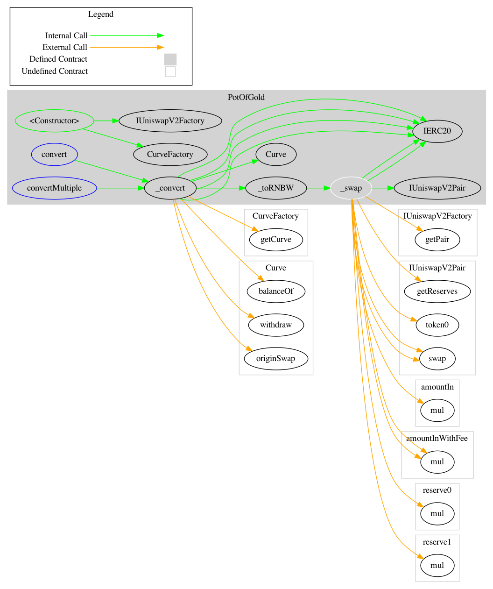
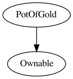

<div id="splash">
    <div id="project">
          <span class="splash-title">
               Project
          </span>
          <br />
          <span id="project-value">
               Halo Rewards
          </span>
    </div>
     <div id="details">
          <div id="left">
               <span class="splash-title">
                    Client
               </span>
               <br />
               <span class="details-value">
                    HaloDAO
               </span>
               <br />
               <span class="splash-title">
                    Date
               </span>
               <br />
               <span class="details-value">
                    August 2021
               </span>
          </div>
          <div id="right">
               <span class="splash-title">
                    Reviewers
               </span>
               <br />
               <span class="details-value">
                    Andrei Simion
               </span><br />
               <span class="contact">@andreiashu</span>
               <br />
               <span class="details-value">
                    Daniel Luca
               </span><br />
               <span class="contact">@cleanunicorn</span>
          </div>
    </div>
</div>


## Table of Contents
 - [Details](#details)
 - [Issues Summary](#issues-summary)
 - [Executive summary](#executive-summary)
 - [Scope](#scope)
 - [Recommendations](#recommendations)
 - [Issues](#issues)
     - [PotOfGold.convert() is vulnerable to price manipulation attacks](#potofgoldconvert-is-vulnerable-to-price-manipulation-attacks)
     - [Unnecessary wrapper function _toRNBW](#unnecessary-wrapper-function-_tornbw)
 - [Artifacts](#artifacts)
     - [Surya](#surya)
 - [Sūrya's Description Report](#suryas-description-report)
     - [Files Description Table](#files-description-table)
     - [Contracts Description Table](#contracts-description-table)
     - [Legend](#legend)
     - [Coverage](#coverage)
     - [Tests](#tests)
 - [License](#license)


## Details

- **Client** HaloDAO
- **Date** August 2021
- **Lead reviewer** Andrei Simion ([@andreiashu](https://twitter.com/andreiashu))
- **Reviewers** Daniel Luca ([@cleanunicorn](https://twitter.com/cleanunicorn)), Andrei Simion ([@andreiashu](https://twitter.com/andreiashu))
- **Repository**: [Halo Rewards](git@github.com:HaloDAO/halo-rewards.git)
- **Commit hash** `ba98ffa136d84ba47bcd2583c411d16d40ab9d5f`
- **Technologies**
  - Solidity
  - TypeScript

## Issues Summary

| SEVERITY       |    OPEN    |    CLOSED    |
|----------------|:----------:|:------------:|
|  Informational  |  0  |  0  |
|  Minor  |  1  |  0  |
|  Medium  |  1  |  0  |
|  Major  |  0  |  0  |

## Executive summary

This report represents the results of the engagement with **HaloDAO** to review **Halo Rewards**.

The review is part of a broader engagement with HaloDAO that includes several other components from the HaloDAO ecosystem (Halo Rewards, Halo AMM, Halo Bridge, Halo Bridge Handler).

The full review (across above-mentioned repositories) was conducted over the course of **2 weeks** from **16th of August to 27th of August, 2021**. We spent a total of **20 person-days** reviewing the code.

## Scope

The initial review focused on the [Halo Rewards](git@github.com:HaloDAO/halo-rewards.git) repository, identified by the commit hash `ba98ffa136d84ba47bcd2583c411d16d40ab9d5f`.

We focused on manually reviewing the codebase, searching for security issues such as, but not limited to, re-entrancy problems, transaction ordering, block timestamp dependency, exception handling, call stack depth limitation, integer overflow/underflow, self-destructible contracts, unsecured balance, use of origin, costly gas patterns, architectural problems, code readability.

**Includes:**
- code/contracts/PotOfGold.sol

## Recommendations

We identified a few possible general improvements that are not security issues during the review, which will bring value to the developers and the community reviewing and using the product.

A good rule of thumb is to have 100% test coverage. This does not guarantee the lack of security problems, but it means that the desired functionality behaves as intended. The negative tests also bring a lot of value because not allowing some actions to happen is also part of the desired behavior.


## Issues


### [`PotOfGold.convert()` is vulnerable to price manipulation attacks](https://github.com/monoceros-alpha/review-halo-rewards-2021-08/issues/1)
 

**Description**

The _owner_ of the `PotOfGold` contract can issue a call to `convert` (or `convertMultiple`) functions in order to convert the accumulated `token` amount into RNBW tokens:


[code/contracts/PotOfGold.sol#L50](https://github.com/monoceros-alpha/review-halo-rewards-2021-08/blob/215f43240eddb2b6c52e3550d6323b9637d7190f/code/contracts/PotOfGold.sol#L50)
```solidity
  function convert(address token, uint256 deadline) external onlyOwner {
```

An intermediary conversion step is required, whereby the amount of accumulated `token` is first converted to `USDC`. The issue here is that the `Curve.originSwap` function gets passed `0` as the `_minTargetAmount` argument and exposes the owner to a price manipulation attack (more details below):


[code/contracts/PotOfGold.sol#L83-L84](https://github.com/monoceros-alpha/review-halo-rewards-2021-08/blob/215f43240eddb2b6c52e3550d6323b9637d7190f/code/contracts/PotOfGold.sol#L83-L84)
```solidity
    // 4 - swap non usdc to usdc using our AMM
    curve.originSwap(token, usdc, nonUsdcTokenBalance, 0, deadline);
```

Definition of the `originSwap` function:


[code/contracts/amm/Curve.sol#L452-L458](https://github.com/monoceros-alpha/review-halo-rewards-2021-08/blob/215f43240eddb2b6c52e3550d6323b9637d7190f/code/contracts/amm/Curve.sol#L452-L458)
```solidity
  function originSwap(
    address _origin,
    address _target,
    uint256 _originAmount,
    uint256 _minTargetAmount,
    uint256 _deadline
  )
```

The final step converts the available `USDC` into `RNBW` using Uniswap V2 contract but the two calls to `pair.swap()` are also vulnerable to a price manipulation attack:


[code/contracts/PotOfGold.sol#L116-L124](https://github.com/monoceros-alpha/review-halo-rewards-2021-08/blob/215f43240eddb2b6c52e3550d6323b9637d7190f/code/contracts/PotOfGold.sol#L116-L124)
```solidity
      pair.swap(0, amountOut, to, new bytes(0));
    } else {
      amountOut = amountInWithFee.mul(reserve0).div(
        reserve1.mul(1000).add(amountInWithFee)
      );

      IERC20(fromToken).safeTransfer(address(pair), amountIn);

      pair.swap(amountOut, 0, to, new bytes(0));
```

The reason why the above two implementations are vulnerable to price manipulation is explained in the Uniswap V2 [**Safety Considerations** section](https://docs.uniswap.org/protocol/V2/guides/smart-contract-integration/trading-from-a-smart-contract):

> Because Ethereum transactions occur in an adversarial environment, smart contracts that do not perform safety checks can be exploited for profit. If a smart contract assumes that the current price on Uniswap is a "fair" price without performing safety checks, it is vulnerable to manipulation. A bad actor could e.g. easily insert transactions before and after the swap (a "sandwich" attack) causing the smart contract to trade at a much worse price, profit from this at the trader's expense, and then return the contracts to their original state. (One important caveat is that these types of attacks are mitigated by trading in extremely liquid pools, and/or at low values.)

**Recommendation**

The best way to protect against these attacks is to use an external price feed or "price oracle". The best "oracle" is simply traders' off-chain observation of the current price, which can be passed into the trade as a safety check.

The `convert` function can accept an additional parameter `minRNBWAmount` that can be checked after the two above steps are performed to ensure that an expected minimum amount of RNBW tokens were transferred to the Rainbow Pool.

**References**

[Uniswap V2 Documentation: Implement a Swap](https://docs.uniswap.org/protocol/V2/guides/smart-contract-integration/trading-from-a-smart-contract)

[DEFI Sandwich Attack Explaination](https://medium.com/coinmonks/defi-sandwich-attack-explain-776f6f43b2fd)


---


### [Unnecessary wrapper function `_toRNBW`](https://github.com/monoceros-alpha/review-halo-rewards-2021-08/issues/2)
 

**Description**

The `_toRNBW` function is called from `_convert` in order to convert `USDC` tokens to `RNBW` tokens:


[code/contracts/PotOfGold.sol#L87-L94](https://github.com/monoceros-alpha/review-halo-rewards-2021-08/blob/215f43240eddb2b6c52e3550d6323b9637d7190f/code/contracts/PotOfGold.sol#L87-L94)
```solidity
    emit LogConvert(
      msg.sender,
      usdc,
      token,
      usdcTokenBalanceBeforeSwap,
      nonUsdcTokenBalance,
      _toRNBW(usdc, IERC20(usdc).balanceOf(address(this))) // returns RNBWOut after converting
    );
```

But `_toRNBW` is a wrapper for `_swap` function:


[code/contracts/PotOfGold.sol#L128-L134](https://github.com/monoceros-alpha/review-halo-rewards-2021-08/blob/215f43240eddb2b6c52e3550d6323b9637d7190f/code/contracts/PotOfGold.sol#L128-L134)
```solidity
  function _toRNBW(address token, uint256 amountIn)
    internal
    returns (uint256 amountOut)
  {
    amountOut = _swap(token, rnbw, amountIn, rainbowPool);
  }
}
```

The presence of this wrapper function makes the code harder to follow.

**Recommendation**

Please call `_swap` directly from `_covert` and remove the wrapper `_toRNBW` function to help with the readability of the code.


---


## Artifacts

### Surya

Sūrya is a utility tool for smart contract systems. It provides a number of visual outputs and information about the structure of smart contracts. It also supports querying the function call graph in multiple ways to aid in the manual inspection and control flow analysis of contracts.

## Sūrya's Description Report

### Files Description Table


|  File Name  |  SHA-1 Hash  |
|-------------|--------------|
| code/contracts/PotOfGold.sol | 325136d679d74205ca55f7d050cf0eac5bf08723 |


### Contracts Description Table


|  Contract  |         Type        |       Bases      |                  |                 |
|:----------:|:-------------------:|:----------------:|:----------------:|:---------------:|
|     └      |  **Function Name**  |  **Visibility**  |  **Mutability**  |  **Modifiers**  |
||||||
| **PotOfGold** | Implementation | Ownable |||
| └ | <Constructor> | Public ❗️ | 🛑  |NO❗️ |
| └ | convert | External ❗️ | 🛑  | onlyOwner |
| └ | convertMultiple | External ❗️ | 🛑  | onlyOwner |
| └ | _convert | Internal 🔒 | 🛑  | |
| └ | _swap | Internal 🔒 | 🛑  | |
| └ | _toRNBW | Internal 🔒 | 🛑  | |


### Legend

|  Symbol  |  Meaning  |
|:--------:|-----------|
|    🛑    | Function can modify state |
|    💵    | Function is payable |


#### Graphs

***PotOfGold Graph***




***PotOfGold Inheritance***



#### Describe

```text
$ npx surya describe code/contracts/PotOfGold.sol
 +  PotOfGold (Ownable)
    - [Pub] <Constructor> #
    - [Ext] convert #
       - modifiers: onlyOwner
    - [Ext] convertMultiple #
       - modifiers: onlyOwner
    - [Int] _convert #
    - [Int] _swap #
    - [Int] _toRNBW #


 ($) = payable function
 # = non-constant function
```

### Coverage

```text
$ yarn add  --dev solidity-coverage
# added `import "solidity-coverage"` to hardhat.config.ts

$ npx hardhat coverage

Version
=======
> solidity-coverage: v0.7.16

Instrumenting for coverage...
=============================

> amm/Assimilators.sol
> amm/Curve.sol
> amm/CurveFactory.sol
> amm/CurveMath.sol
> amm/interfaces/IAssimilator.sol
> amm/interfaces/IFreeFromUpTo.sol
> amm/interfaces/IOracle.sol
> amm/lib/ABDKMath64x64.sol
> amm/lib/UnsafeMath64x64.sol
> amm/MerkleProver.sol
> amm/mocks/MockAssimilator.sol
> amm/mocks/MockOracle.sol
> amm/mocks/MockUsdUsdcAssimilator.sol
> amm/Orchestrator.sol
> amm/ProportionalLiquidity.sol
> amm/Storage.sol
> amm/Swaps.sol
> amm/ViewLiquidity.sol
> AmmRewards.sol
> HaloHalo.sol
> HaloToken.sol
> interfaces/IMinter.sol
> interfaces/IRewarder.sol
> interfaces/IRewards.sol
> lib/SignedSafeMath.sol
> LollipopPool.sol
> LPOP.sol
> mock/CollateralERC20.sol
> mock/ERC20Mock.sol
> mock/LpToken.sol
> mock/Minter.sol
> mock/PotOfGoldExploitMock.sol
> mock/UBE.sol
> PotOfGold.sol
> RewardsManager.sol
> test/RecalculateRewardsPerBlockTest.sol
> uniswapv2/interfaces/IERC20.sol
> uniswapv2/interfaces/IUniswapV2Callee.sol
> uniswapv2/interfaces/IUniswapV2ERC20.sol
> uniswapv2/interfaces/IUniswapV2Factory.sol
> uniswapv2/interfaces/IUniswapV2Pair.sol
> uniswapv2/interfaces/IUniswapV2Router01.sol
> uniswapv2/interfaces/IUniswapV2Router02.sol
> uniswapv2/interfaces/IWETH.sol
> uniswapv2/libraries/Math.sol
> uniswapv2/libraries/SafeMath.sol
> uniswapv2/libraries/TransferHelper.sol
> uniswapv2/libraries/UniswapV2Library.sol
> uniswapv2/libraries/UQ112x112.sol
> uniswapv2/UniswapV2ERC20.sol
> uniswapv2/UniswapV2Factory.sol
> uniswapv2/UniswapV2Pair.sol
> uniswapv2/UniswapV2Router02.sol

Compilation:
============

Compiling 63 files with 0.6.12
contracts/amm/mocks/MockAssimilator.sol:168:5: Warning: Unused function parameter. Remove or comment out the variable name to silence this warning.
    uint256 _baseWeight,
    ^-----------------^

contracts/mock/Minter.sol:128:5: Warning: Function state mutability can be restricted to view
    function getUserCollateralByCollateralAddress(
    ^ (Relevant source part starts here and spans across multiple lines).

contracts/test/RecalculateRewardsPerBlockTest.sol:60:3: Warning: Function state mutability can be restricted to pure
  function recalculateRewardUsingEpochRewardAmountTest(
  ^ (Relevant source part starts here and spans across multiple lines).

contracts/test/RecalculateRewardsPerBlockTest.sol:69:3: Warning: Function state mutability can be restricted to pure
  function recalculateRewardPerBlockTest(
  ^ (Relevant source part starts here and spans across multiple lines).

contracts/AmmRewards.sol:14:1: Warning: Contract code size exceeds 24576 bytes (a limit introduced in Spurious Dragon). This contract may not be deployable on mainnet. Consider enabling the optimizer (with a low "runs" value!), turning off revert strings, or using libraries.
contract AmmRewards is ReentrancyGuard, Ownable {
^ (Relevant source part starts here and spans across multiple lines).

contracts/amm/Orchestrator.sol:27:1: Warning: Contract code size exceeds 24576 bytes (a limit introduced in Spurious Dragon). This contract may not be deployable on mainnet. Consider enabling the optimizer (with a low "runs" value!), turning off revert strings, or using libraries.
library Orchestrator {
^ (Relevant source part starts here and spans across multiple lines).

contracts/amm/ProportionalLiquidity.sol:14:1: Warning: Contract code size exceeds 24576 bytes (a limit introduced in Spurious Dragon). This contract may not be deployable on mainnet. Consider enabling the optimizer (with a low "runs" value!), turning off revert strings, or using libraries.
library ProportionalLiquidity {
^ (Relevant source part starts here and spans across multiple lines).

contracts/amm/Swaps.sol:13:1: Warning: Contract code size exceeds 24576 bytes (a limit introduced in Spurious Dragon). This contract may not be deployable on mainnet. Consider enabling the optimizer (with a low "runs" value!), turning off revert strings, or using libraries.
library Swaps {
^ (Relevant source part starts here and spans across multiple lines).

contracts/amm/Curve.sol:317:1: Warning: Contract code size exceeds 24576 bytes (a limit introduced in Spurious Dragon). This contract may not be deployable on mainnet. Consider enabling the optimizer (with a low "runs" value!), turning off revert strings, or using libraries.
contract Curve is Storage, MerkleProver {
^ (Relevant source part starts here and spans across multiple lines).

contracts/amm/CurveFactory.sol:26:1: Warning: Contract code size exceeds 24576 bytes (a limit introduced in Spurious Dragon). This contract may not be deployable on mainnet. Consider enabling the optimizer (with a low "runs" value!), turning off revert strings, or using libraries.
contract CurveFactory is Ownable {
^ (Relevant source part starts here and spans across multiple lines).

contracts/uniswapv2/UniswapV2Pair.sol:17:1: Warning: Contract code size exceeds 24576 bytes (a limit introduced in Spurious Dragon). This contract may not be deployable on mainnet. Consider enabling the optimizer (with a low "runs" value!), turning off revert strings, or using libraries.
contract UniswapV2Pair is UniswapV2ERC20 {
^ (Relevant source part starts here and spans across multiple lines).

contracts/uniswapv2/UniswapV2Factory.sol:8:1: Warning: Contract code size exceeds 24576 bytes (a limit introduced in Spurious Dragon). This contract may not be deployable on mainnet. Consider enabling the optimizer (with a low "runs" value!), turning off revert strings, or using libraries.
contract UniswapV2Factory is IUniswapV2Factory {
^ (Relevant source part starts here and spans across multiple lines).

contracts/uniswapv2/UniswapV2Router02.sol:13:1: Warning: Contract code size exceeds 24576 bytes (a limit introduced in Spurious Dragon). This contract may not be deployable on mainnet. Consider enabling the optimizer (with a low "runs" value!), turning off revert strings, or using libraries.
contract UniswapV2Router02 is IUniswapV2Router02 {
^ (Relevant source part starts here and spans across multiple lines).

Compilation finished successfully
Creating Typechain artifacts in directory typechain for target ethers-v5
Successfully generated Typechain artifacts!

Network Info
============
> HardhatEVM: v2.4.1
> network:    hardhat

Creating Typechain artifacts in directory typechain for target ethers-v5
Successfully generated Typechain artifacts!
BASIS_POINTS =  10000


  Amm Rewards
    PoolLength
      ✓ PoolLength should execute
    Set
      ✓ Should emit event LogSetPool (60ms)
      ✓ Should revert if invalid pool (38ms)
    Pending Reward Token
      ✓ Pending Reward Token should equal Expected Reward Token (116ms)
      ✓ When time is lastRewardTime (103ms)
    MassUpdatePools
      ✓ Should call updatePool
      ✓ Updating invalid pools should fail
    Add
      ✓ Should add pool with reward token multiplier. Should not add existing lp token
    UpdatePool
      ✓ Should emit event LogUpdatePool (44ms)
    Deposit
      ✓ Depositing 0 amount (60ms)
      ✓ Depositing into non-existent pool should fail
    Withdraw
      ✓ Withdraw 0 amount (48ms)
    Harvest
      ✓ Should give back the correct amount of Reward Token (126ms)
      ✓ Harvest with empty user balance (44ms)
    EmergencyWithdraw
      ✓ Should emit event EmergencyWithdraw (67ms)
    Admin functions
      ✓ Non-owner should not be able to add pool
      ✓ Owner should be able to add pool
      ✓ Non-owner should not be able to set pool allocs (44ms)
      ✓ Owner should be able to set pool allocs
      ✓ Non-owner should not be able to set rewardTokenPerSecond
      ✓ Owner should be able to set rewardTokenPerSecond
    Set rewardTokenPerSecond
      ✓ Non-owner should not be able to set rewardTokenPerSecond
      ✓ RewardsManager should change rewardTokenPerSecond (74ms)
      ✓ Owner should be able to set rewardTokenPerSecond

  Halo Token
===================Deploying Contracts=====================
halo token deployed
Minted initial HALO for owner account
Minted initial HALO for addr1 account
    Check Contract Deployment
      ✓ HaloToken should be deployed
    I should be able to transfer HALO tokens
      ✓ Allow transfer
    I should be able to mint HALO tokens and get the correct totalSupply
      ✓ Only owner should mint
5e+25  HALO tokens owner balance
      ✓ When owner mints, the total supply should be equal to all wallet balance
    I should not be allowed to mint if capped is already locked
      ✓ Only owner can execute setCapped
      ✓ Should revert mint when capped is locked
      ✓ Should revert setCapped func if it has been executed more than once
    I should be able to burn HALO tokens and get the correct totalSupply
      ✓ Only account holder should burn
      ✓ Only owner should burn users tokens
4e+25 HALO tokens owner balance
      ✓ When user burns, the total supply should be equal to all wallet balance
      ✓ Burn amount should not exceed wallet balance

  HALOHALO Contract
===================Deploying Contracts=====================
halo token deployed
40000000 HALO minted to 0x959FD7Ef9089B7142B6B908Dc3A8af7Aa8ff0FA1

halohalo deployed
==========================================================


    Check Contract Deployments
      ✓ HaloToken should be deployed
      ✓ Halohalo should be deployed
    Earn vesting rewards by staking HALO inside halohalo
      ✓ Genesis is zero
      ✓ Deposit HALO tokens to halohalo contract to receive halohalo
      ✓ Calculates current value of HALOHALO in terms of HALO without vesting
      ✓ Calculates current value of HALOHALO in terms of HALO after vesting
      ✓ Claim staked HALO + bonus rewards from Halohalo and burn halohalo
Minting HALO to be entered in the halohalo contract..

Minting 100 HALO to User A...
Minting 100 HALO to User B...
Minting 100 HALO to User C...
100 HALO deposited by User A to halohalo
Simulate releasing vested bonus tokens to halohalo from Rewards contract #1
100 HALO deposited by User B to halohalo
Simulate releasing vested bonus tokens to halohalo from Rewards contract #2
100 HALO deposited by User C to halohalo
Transfer to 0xB0201641d9b936eB20155a38439Ae6AB07d85Fbd approved
All users leave halohalo
Address 0 left
Address 1 left
Address 2 left
      ✓ HALO earned by User A > HALO earned by User B > HALO earned by User C (174ms)

  LPOP Token
===================Deploying Contracts=====================
halo token deployed
Minted initial LPOP for owner account
Minted initial HALO for addr1 account
    Check Contract Deployment
      ✓ HaloToken should be deployed
    I should be able to transfer HALO tokens
      ✓ Allow transfer
    I should be able to mint HALO tokens and get the correct totalSupply
      ✓ Only owner should mint
5e+25  HALO tokens owner balance
      ✓ When owner mints, the total supply should be equal to all wallet balance
    I should be able to burn LPOP tokens and get the correct totalSupply
      ✓ Only account holder should burn
      ✓ Only owner should burn users tokens
4e+25 HALO tokens owner balance
      ✓ When user burns, the total supply should be equal to all wallet balance
      ✓ Burn amount should not exceed wallet balance

  PotOfGold
    convert
      ✓ should convert minted Curve LP fees to RNBW  (772ms)
      ✓ should allow to convert multiple Curves LP fees using convertMultiple (1899ms)
      ✓ reverts if caller is not owner for convert()
      ✓ reverts if caller is not owner for convertMultiple()
      ✓ should revert when there are no curve on the given tokens
      ✓ should revert if swap in our AMM failed (1982ms)
      ✓ should revert if we do not send curves in the contract

  Rewards Manager
===================Deploying Contracts=====================
collateralERC20 deployed
halo token deployed
halohalo deployed
changedHaloHaloContract deployed
Set Rewards Manager contract.
Deployed Rewards Manager Contract address: 0xAf2Ee099b652D793CED2a2Cb0e6fC2f59BdDc748
==========================================================


    Check Contract Deployments
      ✓ HaloToken should be deployed
      ✓ Halohalo should be deployed
      ✓ Lptoken should be deployed
      ✓ Rewards Management Contract should be deployed
    Admin functions can be set by the owner
      ✓ can set the vestingRatio if the caller is the owner
      ✓ can not set the vestingRatio if the caller is not the owner
      ✓ can not set the vesting ratio if vesting ratio is equal to zero
      ✓ can set the rewards contract if the caller is the owner
      ✓ can not set the rewards contract if the caller is not the owner
      ✓ can not set the rewards contract if address parameter is address(0)
      ✓ can set the halohalo contract if the caller is the owner
      ✓ can not set the halohalo contract if the caller is not the owner
      ✓ can not set the halohalo contract if the address parameter is address(0)
    Released HALO will be distributed 80% to the rewards contract converted to DESRT and 20% will be vested to the halohalo contract
      ✓ Release rewards in Epoch 0, HALOHALO priced to one at the end (72ms)
      ✓ Release rewards in Epoch 1, HALOHALO priced to 1.25 at the end  (69ms)
      ✓ fails if the caller is not the owner

  xLPOP Contract
===================Deploying Contracts=====================
LPOP token deployed
40000000 LPOP minted to 0x959FD7Ef9089B7142B6B908Dc3A8af7Aa8ff0FA1

xLPOP deployed
==========================================================


    Check Contract Deployments
      ✓ HaloToken should be deployed
      ✓ Halohalo should be deployed
    Earn vesting rewards by staking HALO inside halohalo
      ✓ Genesis is zero
      ✓ Deposit LPOP tokens to Lollipop Pool contract to receive xLPOP
      ✓ Calculates current value of xLPOP in terms of LPOP without vesting
      ✓ Calculates current value of xLPOP in terms of LPOP after vesting
      ✓ Claim staked LPOP + bonus rewards from Lollipop Pool and burn xLPOP
Minting LPOP to be entered in the halohalo contract..

Minting 100 HALO to User A...
Minting 100 HALO to User B...
Minting 100 HALO to User C...
100 HALO deposited by User A to halohalo
Simulate releasing vested bonus tokens to Lollipop Pool from Rewards contract #1
100 HALO deposited by User B to halohalo
Simulate releasing vested bonus tokens to Lollipop Pool from Rewards contract #2
100 LPOP deposited by User C to Lollipop Pool
Transfer to 0xB0201641d9b936eB20155a38439Ae6AB07d85Fbd approved
All users leave Lollipop Pool
Address 0 left
Address 1 left
Address 2 left
      ✓ LPOP earned by User A > LPOP earned by User B > LPOP earned by User C (149ms)


  82 passing (27s)

-------------------------------------|----------|----------|----------|----------|----------------|
File                                 |  % Stmts | % Branch |  % Funcs |  % Lines |Uncovered Lines |
-------------------------------------|----------|----------|----------|----------|----------------|
 contracts/                          |    88.27 |    76.67 |    97.73 |    88.27 |                |
  AmmRewards.sol                     |    78.26 |    65.38 |    93.33 |    78.26 |... 261,262,276 |
  HaloHalo.sol                       |      100 |    83.33 |      100 |      100 |                |
  HaloToken.sol                      |      100 |      100 |      100 |      100 |                |
  LPOP.sol                           |      100 |      100 |      100 |      100 |                |
  LollipopPool.sol                   |      100 |    83.33 |      100 |      100 |                |
  PotOfGold.sol                      |    90.32 |       75 |      100 |    90.32 |    118,122,124 |
  RewardsManager.sol                 |      100 |       90 |      100 |      100 |                |
 contracts/amm/                      |    58.74 |    36.14 |    57.73 |    59.37 |                |
  Assimilators.sol                   |       50 |       50 |    53.33 |    51.85 |... 186,192,194 |
  Curve.sol                          |    44.44 |    27.27 |    46.51 |    47.13 |... 738,749,759 |
  CurveFactory.sol                   |    95.83 |       50 |      100 |    95.83 |             56 |
  CurveMath.sol                      |    66.67 |    47.37 |     87.5 |    68.13 |... 258,260,261 |
  MerkleProver.sol                   |        0 |      100 |        0 |        0 |          18,19 |
  Orchestrator.sol                   |       75 |       40 |    66.67 |    76.19 |... 277,279,281 |
  ProportionalLiquidity.sol          |       64 |    33.33 |    83.33 |       64 |... 167,174,176 |
  Storage.sol                        |      100 |      100 |      100 |      100 |                |
  Swaps.sol                          |    46.23 |    28.57 |    55.56 |    46.23 |... 445,446,448 |
  ViewLiquidity.sol                  |        0 |      100 |        0 |        0 |... 37,41,42,45 |
 contracts/amm/interfaces/           |      100 |      100 |      100 |      100 |                |
  IAssimilator.sol                   |      100 |      100 |      100 |      100 |                |
  IFreeFromUpTo.sol                  |      100 |      100 |      100 |      100 |                |
  IOracle.sol                        |      100 |      100 |      100 |      100 |                |
 contracts/amm/lib/                  |     9.63 |     5.41 |    36.67 |    10.16 |                |
  ABDKMath64x64.sol                  |     9.23 |     5.41 |    35.71 |     9.74 |... 792,793,794 |
  UnsafeMath64x64.sol                |       50 |      100 |       50 |       50 |          29,30 |
 contracts/amm/mocks/                |    47.24 |    26.32 |    57.58 |    46.72 |                |
  MockAssimilator.sol                |    48.53 |    27.27 |       60 |    48.44 |... 288,291,295 |
  MockOracle.sol                     |      100 |      100 |      100 |      100 |                |
  MockUsdUsdcAssimilator.sol         |    38.46 |       25 |    46.67 |    37.25 |... 215,217,219 |
 contracts/interfaces/               |      100 |      100 |      100 |      100 |                |
  IMinter.sol                        |      100 |      100 |      100 |      100 |                |
  IRewarder.sol                      |      100 |      100 |      100 |      100 |                |
  IRewards.sol                       |      100 |      100 |      100 |      100 |                |
 contracts/lib/                      |    44.44 |    18.75 |       60 |    44.44 |                |
  SignedSafeMath.sol                 |    44.44 |    18.75 |       60 |    44.44 |... 47,48,50,52 |
 contracts/mock/                     |    17.86 |      100 |    36.84 |    17.86 |                |
  CollateralERC20.sol                |        0 |      100 |    33.33 |        0 |          15,19 |
  ERC20Mock.sol                      |      100 |      100 |      100 |      100 |                |
  LpToken.sol                        |       50 |      100 |    66.67 |       50 |             19 |
  Minter.sol                         |        0 |      100 |        0 |        0 |... ,97,102,106 |
  PotOfGoldExploitMock.sol           |      100 |      100 |      100 |      100 |                |
  UBE.sol                            |        0 |      100 |        0 |        0 |          15,19 |
 contracts/test/                     |        0 |        0 |        0 |        0 |                |
  RecalculateRewardsPerBlockTest.sol |        0 |        0 |        0 |        0 |... 33,36,42,50 |
 contracts/uniswapv2/                |    29.07 |       20 |    23.64 |    30.21 |                |
  UniswapV2ERC20.sol                 |    19.23 |        0 |    22.22 |    22.22 |... 84,91,92,93 |
  UniswapV2Factory.sol               |       60 |       25 |    28.57 |     61.9 |... 53,54,58,59 |
  UniswapV2Pair.sol                  |    62.04 |    40.38 |       75 |    65.38 |... 206,207,212 |
  UniswapV2Router02.sol              |        0 |        0 |        0 |        0 |... 425,435,445 |
 contracts/uniswapv2/interfaces/     |      100 |      100 |      100 |      100 |                |
  IERC20.sol                         |      100 |      100 |      100 |      100 |                |
  IUniswapV2Callee.sol               |      100 |      100 |      100 |      100 |                |
  IUniswapV2ERC20.sol                |      100 |      100 |      100 |      100 |                |
  IUniswapV2Factory.sol              |      100 |      100 |      100 |      100 |                |
  IUniswapV2Pair.sol                 |      100 |      100 |      100 |      100 |                |
  IUniswapV2Router01.sol             |      100 |      100 |      100 |      100 |                |
  IUniswapV2Router02.sol             |      100 |      100 |      100 |      100 |                |
  IWETH.sol                          |      100 |      100 |      100 |      100 |                |
 contracts/uniswapv2/libraries/      |    19.64 |    10.53 |    31.58 |       20 |                |
  Math.sol                           |    66.67 |       25 |       50 |       75 |           9,22 |
  SafeMath.sol                       |      100 |       50 |      100 |      100 |                |
  TransferHelper.sol                 |        0 |        0 |        0 |        0 |... 21,22,26,27 |
  UQ112x112.sol                      |      100 |      100 |      100 |      100 |                |
  UniswapV2Library.sol               |        0 |        0 |        0 |        0 |... 78,79,80,81 |
-------------------------------------|----------|----------|----------|----------|----------------|
All files                            |     41.5 |    21.69 |    51.47 |     42.4 |                |
-------------------------------------|----------|----------|----------|----------|----------------|

> Istanbul reports written to ./coverage/ and ./coverage.json
```

### Tests

```text

$ yarn run node

# separate terminal
$ yarn run test

yarn run v1.22.4
warning package.json: No license field
$ npx hardhat --network localhost test 
Creating Typechain artifacts in directory typechain for target ethers-v5
Successfully generated Typechain artifacts!
BASIS_POINTS =  10000

  Amm Rewards
    PoolLength
      ✓ PoolLength should execute (209826 gas)
    Set
      ✓ Should emit event LogSetPool (307545 gas)
      ✓ Should revert if invalid pool
    Pending Reward Token
      ✓ Pending Reward Token should equal Expected Reward Token (430896 gas)
      ✓ When time is lastRewardTime (430896 gas)
    MassUpdatePools
      ✓ Should call updatePool (257072 gas)
      ✓ Updating invalid pools should fail
    Add
      ✓ Should add pool with reward token multiplier. Should not add existing lp token (209826 gas)
    UpdatePool
      ✓ Should emit event LogUpdatePool (256981 gas)
    Deposit
      ✓ Depositing 0 amount (313131 gas)
      ✓ Depositing into non-existent pool should fail
    Withdraw
      ✓ Withdraw 0 amount (277941 gas)
    Harvest
      ✓ Should give back the correct amount of Reward Token (531677 gas)
      ✓ Harvest with empty user balance (268533 gas)
    EmergencyWithdraw
      ✓ Should emit event EmergencyWithdraw (388181 gas)
    Admin functions
      ✓ Non-owner should not be able to add pool
      ✓ Owner should be able to add pool (209826 gas)
      ✓ Non-owner should not be able to set pool allocs (209826 gas)
      ✓ Owner should be able to set pool allocs (254029 gas)
      ✓ Non-owner should not be able to set rewardTokenPerSecond
      ✓ Owner should be able to set rewardTokenPerSecond (32504 gas)
    Set rewardTokenPerSecond
      ✓ Non-owner should not be able to set rewardTokenPerSecond
      ✓ RewardsManager should change rewardTokenPerSecond (163407 gas)
      ✓ Owner should be able to set rewardTokenPerSecond (32504 gas)

  Halo Token
===================Deploying Contracts=====================
halo token deployed
Minted initial HALO for owner account
Minted initial HALO for addr1 account
    Check Contract Deployment
      ✓ HaloToken should be deployed (54478 gas)
    I should be able to transfer HALO tokens
      ✓ Allow transfer (89841 gas)
    I should be able to mint HALO tokens and get the correct totalSupply
      ✓ Only owner should mint (72741 gas)
5e+25  HALO tokens owner balance
      ✓ When owner mints, the total supply should be equal to all wallet balance (74756 gas)
    I should not be allowed to mint if capped is already locked
      ✓ Only owner can execute setCapped (64281 gas)
      ✓ Should revert mint when capped is locked (26903 gas)
      ✓ Should revert setCapped func if it has been executed more than once (26903 gas)
    I should be able to burn HALO tokens and get the correct totalSupply
      ✓ Only account holder should burn (61277 gas)
      ✓ Only owner should burn users tokens (144521 gas)
4e+25 HALO tokens owner balance
      ✓ When user burns, the total supply should be equal to all wallet balance (62005 gas)
      ✓ Burn amount should not exceed wallet balance (34374 gas)

  HALOHALO Contract
===================Deploying Contracts=====================
halo token deployed
40000000 HALO minted to 0x959FD7Ef9089B7142B6B908Dc3A8af7Aa8ff0FA1

halohalo deployed
==========================================================


    Check Contract Deployments
      ✓ HaloToken should be deployed (37402 gas)
      ✓ Halohalo should be deployed (37402 gas)
    Earn vesting rewards by staking HALO inside halohalo
      ✓ Genesis is zero (37402 gas)
      ✓ Deposit HALO tokens to halohalo contract to receive halohalo (187867 gas)
      ✓ Calculates current value of HALOHALO in terms of HALO without vesting (103501 gas)
      ✓ Calculates current value of HALOHALO in terms of HALO after vesting (140867 gas)
      ✓ Claim staked HALO + bonus rewards from Halohalo and burn halohalo (72122 gas)
Minting HALO to be entered in the halohalo contract..

Minting 100 HALO to User A...
Minting 100 HALO to User B...
Minting 100 HALO to User C...
100 HALO deposited by User A to halohalo
Simulate releasing vested bonus tokens to halohalo from Rewards contract #1
100 HALO deposited by User B to halohalo
Simulate releasing vested bonus tokens to halohalo from Rewards contract #2
100 HALO deposited by User C to halohalo
Transfer to 0xB0201641d9b936eB20155a38439Ae6AB07d85Fbd approved
All users leave halohalo
Address 0 left
Address 1 left
Address 2 left
      ✓ HALO earned by User A > HALO earned by User B > HALO earned by User C (739816 gas)

  LPOP Token
===================Deploying Contracts=====================
halo token deployed
Minted initial LPOP for owner account
Minted initial HALO for addr1 account
    Check Contract Deployment
      ✓ HaloToken should be deployed (53746 gas)
    I should be able to transfer HALO tokens
      ✓ Allow transfer (88496 gas)
    I should be able to mint HALO tokens and get the correct totalSupply
      ✓ Only owner should mint (71396 gas)
5e+25  HALO tokens owner balance
      ✓ When owner mints, the total supply should be equal to all wallet balance (73292 gas)
    I should be able to burn LPOP tokens and get the correct totalSupply
      ✓ Only account holder should burn (70696 gas)
      ✓ Only owner should burn users tokens (142358 gas)
4e+25 HALO tokens owner balance
      ✓ When user burns, the total supply should be equal to all wallet balance (61068 gas)
      ✓ Burn amount should not exceed wallet balance (34050 gas)

  PotOfGold
    convert
      ✓ should convert minted Curve LP fees to RNBW  (377070 gas)
      ✓ should allow to convert multiple Curves LP fees using convertMultiple (5392531 gas)
      ✓ reverts if caller is not owner for convert()
      ✓ reverts if caller is not owner for convertMultiple()
      ✓ should revert when there are no curve on the given tokens
      ✓ should revert if swap in our AMM failed (58103 gas)
      ✓ should revert if we do not send curves in the contract

  Rewards Manager
===================Deploying Contracts=====================
collateralERC20 deployed
halo token deployed
halohalo deployed
changedHaloHaloContract deployed
Set Rewards Manager contract.
Deployed Rewards Manager Contract address: 0xb76b6ae76CEE43e0B32588ffc112eFcA3c781F1E
==========================================================


    Check Contract Deployments
      ✓ HaloToken should be deployed (46340 gas)
      ✓ Halohalo should be deployed (46340 gas)
      ✓ Lptoken should be deployed (46340 gas)
      ✓ Rewards Management Contract should be deployed (46340 gas)
    Admin functions can be set by the owner
      ✓ can set the vestingRatio if the caller is the owner (75061 gas)
      ✓ can not set the vestingRatio if the caller is not the owner (26233 gas)
      ✓ can not set the vesting ratio if vesting ratio is equal to zero (26233 gas)
      ✓ can set the rewards contract if the caller is the owner (55276 gas)
      ✓ can not set the rewards contract if the caller is not the owner (26233 gas)
      ✓ can not set the rewards contract if address parameter is address(0) (26233 gas)
      ✓ can set the halohalo contract if the caller is the owner (55266 gas)
      ✓ can not set the halohalo contract if the caller is not the owner (29033 gas)
      ✓ can not set the halohalo contract if the address parameter is address(0) (26233 gas)
    Released HALO will be distributed 80% to the rewards contract converted to DESRT and 20% will be vested to the halohalo contract
      ✓ Release rewards in Epoch 0, HALOHALO priced to one at the end (340760 gas)
      ✓ Release rewards in Epoch 1, HALOHALO priced to 1.25 at the end  (391356 gas)
      ✓ fails if the caller is not the owner (93929 gas)

  xLPOP Contract
===================Deploying Contracts=====================
LPOP token deployed
40000000 LPOP minted to 0x959FD7Ef9089B7142B6B908Dc3A8af7Aa8ff0FA1

xLPOP deployed
==========================================================


    Check Contract Deployments
      ✓ HaloToken should be deployed (36670 gas)
      ✓ Halohalo should be deployed (36670 gas)
    Earn vesting rewards by staking HALO inside halohalo
      ✓ Genesis is zero (36670 gas)
      ✓ Deposit LPOP tokens to Lollipop Pool contract to receive xLPOP (187628 gas)
      ✓ Calculates current value of xLPOP in terms of LPOP without vesting (104607 gas)
      ✓ Calculates current value of xLPOP in terms of LPOP after vesting (141241 gas)
      ✓ Claim staked LPOP + bonus rewards from Lollipop Pool and burn xLPOP (72097 gas)
Minting LPOP to be entered in the halohalo contract..

Minting 100 HALO to User A...
Minting 100 HALO to User B...
Minting 100 HALO to User C...
100 HALO deposited by User A to halohalo
Simulate releasing vested bonus tokens to Lollipop Pool from Rewards contract #1
100 HALO deposited by User B to halohalo
Simulate releasing vested bonus tokens to Lollipop Pool from Rewards contract #2
100 LPOP deposited by User C to Lollipop Pool
Transfer to 0xB0201641d9b936eB20155a38439Ae6AB07d85Fbd approved
All users leave Lollipop Pool
Address 0 left
Address 1 left
Address 2 left
      ✓ LPOP earned by User A > LPOP earned by User B > LPOP earned by User C (741877 gas)

·------------------------------------------------|----------------------------|-------------|----------------------------·
|              Solc version: 0.6.12              ·  Optimizer enabled: false  ·  Runs: 200  ·  Block limit: 6718946 gas  │
·················································|····························|·············|·····························
|  Methods                                                                                                               │
·····················|···························|··············|·············|·············|··············|··············
|  Contract          ·  Method                   ·  Min         ·  Max        ·  Avg        ·  # calls     ·  eur (avg)  │
·····················|···························|··············|·············|·············|··············|··············
|  AmmRewards        ·  add                      ·      209814  ·     209826  ·     209825  ·          19  ·          -  │
·····················|···························|··············|·············|·············|··············|··············
|  AmmRewards        ·  deposit                  ·       73501  ·     119032  ·     103855  ·           6  ·          -  │
·····················|···························|··············|·············|·············|··············|··············
|  AmmRewards        ·  emergencyWithdraw        ·           -  ·          -  ·      29531  ·           2  ·          -  │
·····················|···························|··············|·············|·············|··············|··············
|  AmmRewards        ·  harvest                  ·       58707  ·      81390  ·      70049  ·           4  ·          -  │
·····················|···························|··············|·············|·············|··············|··············
|  AmmRewards        ·  massUpdatePools          ·           -  ·          -  ·      47258  ·           2  ·          -  │
·····················|···························|··············|·············|·············|··············|··············
|  AmmRewards        ·  set                      ·       38843  ·      58876  ·      49000  ·           5  ·          -  │
·····················|···························|··············|·············|·············|··············|··············
|  AmmRewards        ·  setRewardsManager        ·       46328  ·      46340  ·      46338  ·          29  ·          -  │
·····················|···························|··············|·············|·············|··············|··············
|  AmmRewards        ·  setRewardTokenPerSecond  ·           -  ·          -  ·      32504  ·           3  ·          -  │
·····················|···························|··············|·············|·············|··············|··············
|  AmmRewards        ·  updatePool               ·       47155  ·      72234  ·      63874  ·           6  ·          -  │
·····················|···························|··············|·············|·············|··············|··············
|  AmmRewards        ·  withdraw                 ·       68115  ·      91625  ·      75952  ·           3  ·          -  │
·····················|···························|··············|·············|·············|··············|··············
|  Curve             ·  deposit                  ·           -  ·          -  ·     231588  ·           8  ·          -  │
·····················|···························|··············|·············|·············|··············|··············
|  Curve             ·  originSwap               ·      140557  ·     140569  ·     140567  ·          11  ·          -  │
·····················|···························|··············|·············|·············|··············|··············
|  Curve             ·  setParams                ·           -  ·          -  ·     162916  ·           8  ·          -  │
·····················|···························|··············|·············|·············|··············|··············
|  Curve             ·  turnOffWhitelisting      ·           -  ·          -  ·      29307  ·           8  ·          -  │
·····················|···························|··············|·············|·············|··············|··············
|  CurveFactory      ·  newCurve                 ·     4119478  ·    4119490  ·    4119484  ·           8  ·          -  │
·····················|···························|··············|·············|·············|··············|··············
|  ERC20             ·  transfer                 ·       58091  ·      58103  ·      58096  ·           5  ·          -  │
·····················|···························|··············|·············|·············|··············|··············
|  ERC20Mock         ·  approve                  ·       46568  ·      46580  ·      46579  ·          16  ·          -  │
·····················|···························|··············|·············|·············|··············|··············
|  ERC20Mock         ·  transfer                 ·           -  ·          -  ·      51848  ·          28  ·          -  │
·····················|···························|··············|·············|·············|··············|··············
|  HaloHalo          ·  enter                    ·       49524  ·     103501  ·      82165  ·           6  ·          -  │
·····················|···························|··············|·············|·············|··············|··············
|  HaloHalo          ·  leave                    ·       34744  ·      54487  ·      42641  ·           5  ·          -  │
·····················|···························|··············|·············|·············|··············|··············
|  HaloToken         ·  approve                  ·       46916  ·      46964  ·      46926  ·          30  ·          -  │
·····················|···························|··············|·············|·············|··············|··············
|  HaloToken         ·  burn                     ·           -  ·          -  ·      34374  ·           4  ·          -  │
·····················|···························|··············|·············|·············|··············|··············
|  HaloToken         ·  burnFrom                 ·           -  ·          -  ·      27631  ·           2  ·          -  │
·····················|···························|··············|·············|·············|··············|··············
|  HaloToken         ·  increaseAllowance        ·           -  ·          -  ·      47237  ·           1  ·          -  │
·····················|···························|··············|·············|·············|··············|··············
|  HaloToken         ·  mint                     ·       37366  ·      71578  ·      59531  ·          44  ·          -  │
·····················|···························|··············|·············|·············|··············|··············
|  HaloToken         ·  setCapped                ·           -  ·          -  ·      26903  ·           4  ·          -  │
·····················|···························|··············|·············|·············|··············|··············
|  HaloToken         ·  transfer                 ·       35279  ·      35363  ·      35335  ·           3  ·          -  │
·····················|···························|··············|·············|·············|··············|··············
|  LollipopPool      ·  enter                    ·       50630  ·     104607  ·      83271  ·           6  ·          -  │
·····················|···························|··············|·············|·············|··············|··············
|  LollipopPool      ·  leave                    ·       35451  ·      55901  ·      43631  ·           5  ·          -  │
·····················|···························|··············|·············|·············|··············|··············
|  LPOP              ·  approve                  ·       46303  ·      46351  ·      46315  ·           4  ·          -  │
·····················|···························|··············|·············|·············|··············|··············
|  LPOP              ·  burn                     ·           -  ·          -  ·      34050  ·           5  ·          -  │
·····················|···························|··············|·············|·············|··············|··············
|  LPOP              ·  burnFrom                 ·           -  ·          -  ·      27018  ·           2  ·          -  │
·····················|···························|··············|·············|·············|··············|··············
|  LPOP              ·  increaseAllowance        ·           -  ·          -  ·      46624  ·           1  ·          -  │
·····················|···························|··············|·············|·············|··············|··············
|  LPOP              ·  mint                     ·       36634  ·      53746  ·      41676  ·          17  ·          -  │
·····················|···························|··············|·············|·············|··············|··············
|  LPOP              ·  transfer                 ·       34666  ·      34750  ·      34722  ·           3  ·          -  │
·····················|···························|··············|·············|·············|··············|··············
|  LpToken           ·  approve                  ·       29792  ·      46928  ·      43974  ·          29  ·          -  │
·····················|···························|··············|·············|·············|··············|··············
|  LpToken           ·  mint                     ·           -  ·          -  ·      71335  ·          24  ·          -  │
·····················|···························|··············|·············|·············|··············|··············
|  LpToken           ·  transfer                 ·           -  ·          -  ·      52417  ·          30  ·          -  │
·····················|···························|··············|·············|·············|··············|··············
|  PotOfGold         ·  convert                  ·           -  ·          -  ·     318979  ·           2  ·          -  │
·····················|···························|··············|·············|·············|··············|··············
|  PotOfGold         ·  convertMultiple          ·           -  ·          -  ·     499343  ·           2  ·          -  │
·····················|···························|··············|·············|·············|··············|··············
|  RewardsManager    ·  releaseEpochRewards      ·       93929  ·     211021  ·     195409  ·          30  ·          -  │
·····················|···························|··············|·············|·············|··············|··············
|  RewardsManager    ·  setHaloHaloContract      ·       26233  ·      29033  ·      26793  ·          10  ·          -  │
·····················|···························|··············|·············|·············|··············|··············
|  RewardsManager    ·  setRewardsContract       ·           -  ·          -  ·      29043  ·           1  ·          -  │
·····················|···························|··············|·············|·············|··············|··············
|  RewardsManager    ·  setVestingRatio          ·           -  ·          -  ·      28721  ·           1  ·          -  │
·····················|···························|··············|·············|·············|··············|··············
|  UniswapV2Factory  ·  createPair               ·     3278105  ·    3295227  ·    3286669  ·          14  ·          -  │
·····················|···························|··············|·············|·············|··············|··············
|  UniswapV2Pair     ·  mint                     ·           -  ·          -  ·     158450  ·          14  ·          -  │
·····················|···························|··············|·············|·············|··············|··············
|  Deployments                                   ·                                          ·  % of limit  ·             │
·················································|··············|·············|·············|··············|··············
|  AmmRewards                                    ·     3236915  ·    3236927  ·    3236926  ·      48.2 %  ·          -  │
·················································|··············|·············|·············|··············|··············
|  CollateralERC20                               ·     1750829  ·    1750913  ·    1750871  ·      26.1 %  ·          -  │
·················································|··············|·············|·············|··············|··············
|  CurveFactory                                  ·     5193719  ·    5193755  ·    5193745  ·      77.3 %  ·          -  │
·················································|··············|·············|·············|··············|··············
|  Curves                                        ·           -  ·          -  ·     764657  ·      11.4 %  ·          -  │
·················································|··············|·············|·············|··············|··············
|  ERC20Mock                                     ·     1119301  ·    1119337  ·    1119315  ·      16.7 %  ·          -  │
·················································|··············|·············|·············|··············|··············
|  HaloHalo                                      ·     1747635  ·    1747659  ·    1747657  ·        26 %  ·          -  │
·················································|··············|·············|·············|··············|··············
|  HaloToken                                     ·           -  ·          -  ·    1903664  ·      28.3 %  ·          -  │
·················································|··············|·············|·············|··············|··············
|  LpToken                                       ·           -  ·          -  ·    1750829  ·      26.1 %  ·          -  │
·················································|··············|·············|·············|··············|··············
|  MockAssimilator                               ·     1897415  ·    1897427  ·    1897424  ·      28.2 %  ·          -  │
·················································|··············|·············|·············|··············|··············
|  MockOracle                                    ·      236964  ·     237000  ·     236988  ·       3.5 %  ·          -  │
·················································|··············|·············|·············|··············|··············
|  MockUsdUsdcAssimilator                        ·     1505399  ·    1505411  ·    1505409  ·      22.4 %  ·          -  │
·················································|··············|·············|·············|··············|··············
|  Orchestrator                                  ·           -  ·          -  ·    2120914  ·      31.6 %  ·          -  │
·················································|··············|·············|·············|··············|··············
|  PotOfGold                                     ·     1887435  ·    1887447  ·    1887444  ·      28.1 %  ·          -  │
·················································|··············|·············|·············|··············|··············
|  PotOfGoldExploitMock                          ·           -  ·          -  ·     225933  ·       3.4 %  ·          -  │
·················································|··············|·············|·············|··············|··············
|  ProportionalLiquidity                         ·           -  ·          -  ·    2159674  ·      32.1 %  ·          -  │
·················································|··············|·············|·············|··············|··············
|  RewardsManager                                ·     1606297  ·    1606321  ·    1606317  ·      23.9 %  ·          -  │
·················································|··············|·············|·············|··············|··············
|  Swaps                                         ·           -  ·          -  ·    2911274  ·      43.3 %  ·          -  │
·················································|··············|·············|·············|··············|··············
|  UniswapV2Factory                              ·           -  ·          -  ·    4223318  ·      62.9 %  ·          -  │
·················································|··············|·············|·············|··············|··············
|  ViewLiquidity                                 ·           -  ·          -  ·     239070  ·       3.6 %  ·          -  │
·------------------------------------------------|--------------|-------------|-------------|--------------|-------------·

  82 passing (3m)

✨  Done in 161.66s.
```

## License

This report falls under the terms described in the included [LICENSE](./LICENSE).

<!-- Load highlight.js -->
<link rel="stylesheet"
href="//cdnjs.cloudflare.com/ajax/libs/highlight.js/10.4.1/styles/default.min.css">
<script src="//cdnjs.cloudflare.com/ajax/libs/highlight.js/10.4.1/highlight.min.js"></script>
<script>hljs.initHighlightingOnLoad();</script>
<script type="text/javascript" src="https://cdn.jsdelivr.net/npm/highlightjs-solidity@1.0.20/solidity.min.js"></script>
<script type="text/javascript">
    hljs.registerLanguage('solidity', window.hljsDefineSolidity);
    hljs.initHighlightingOnLoad();
</script>
<link rel="stylesheet" href="./style/print.css"/>
